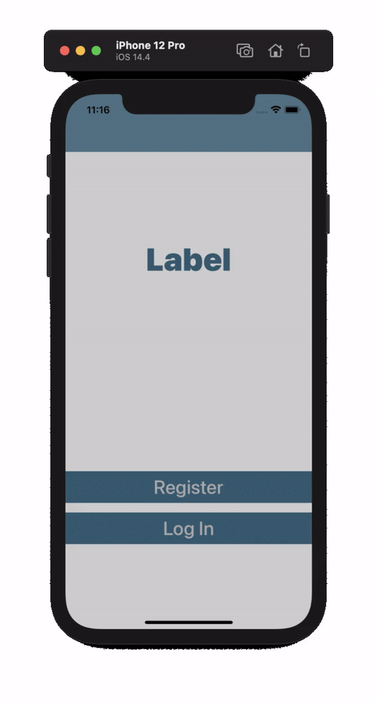

#  ChatApp

## 

## ChatApp is an internet based messaging app sthat is using a service called Firebase Firestore as a backend database to store and retrieve our messages from the cloud. 

## Firebase is used for user authentication, registration and login.

## Third party libraries integrated through Cocoapods.

